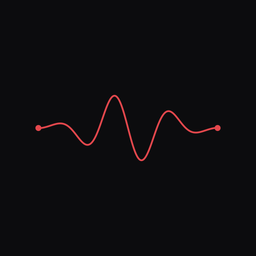

# Essentia CHOP Suite

<p align="center">
  
</p>

Real-time audio analysis for [TouchDesigner](https://derivative.ca/) powered by [Essentia](https://essentia.upf.edu/). Five C++ CHOP plugins expose spectrum analysis, mel bands, MFCCs, pitch detection, key estimation, onset/BPM tracking, and EBU R128 loudness metering — all running natively at TD's cook rate.

[](https://darienbrito.github.io/EssentiaTD/)

# Install

Copy all `.dll` files to your TouchDesigner plugins folder:

```bash
cp src/build/Release/*.dll "C:/Users/<you>/Documents/Derivative/Plugins/"
```

Or into a subfolder — TD scans subdirectories of the Plugins folder.

Restart TouchDesigner to load the new operators. They appear in the OP Create Dialog under their registered names (e.g., Tab > CHOP > "Essentia Spectrum").

## Operators

| Operator | Input | Output | Description |
|---|---|---|---|
| **Essentia Spectrum** | Audio CHOP | 1 ch `spectrum` (fftSize/2+1 samples) | FFT magnitude spectrum as a static sample buffer |
| **Essentia Spectral** | Spectrum CHOP | Per-feature channels (1 sample each) | MFCC, centroid, flux, rolloff, contrast, HFC, complexity, mel bands |
| **Essentia Tonal** | Spectrum CHOP | Per-feature channels (1 sample each) | Pitch (YinFFT), HPCP chroma, key/scale, dissonance, inharmonicity |
| **Essentia Rhythm** | Spectrum CHOP | 6 ch (1 sample each) | Onset detection, BPM (autocorrelation), beat phase/confidence |
| **Essentia Loudness** | Audio CHOP | 7 ch (1 sample each) | EBU R128 loudness, RMS energy, zero-crossing rate |

## Signal Flow

```
Audio CHOP
  ├── Essentia Spectrum ──┬── Essentia Spectral
  │                       ├── Essentia Tonal
  │                       └── Essentia Rhythm
  └── Essentia Loudness
```

**Spectrum** is the shared upstream node for the three spectral-domain CHOPs. **Loudness** takes raw audio directly.

## Spectrum: Analysis, Not Visualization

Essentia Spectrum outputs a linear-bin FFT magnitude spectrum designed for feeding downstream analysis algorithms (Spectral, Tonal, Rhythm). Its bins are uniformly spaced in Hz, which is what Essentia's algorithms expect but looks bottom-heavy when plotted directly — most musical detail is crammed into the lower bins.

For spectral visualization, use TouchDesigner's built-in **Audio Spectrum CHOP**, which provides a perceptually scaled output suited for display. Note that TD's Audio Spectrum cannot be used as input to the Essentia analysis CHOPs — they require the linear-bin format that Essentia Spectrum provides.

## Mono by Design

The suite processes a single audio channel. This is intentional — stereo analysis would double every output channel (e.g., `mfcc0_L`, `mfcc0_R`, `spectral_centroid_L`, `spectral_centroid_R`), making the output unwieldy and harder to map in a visual context.

If you need stereo-aware analysis, select each channel independently using a **Select CHOP** and run two separate analysis chains. This keeps the output organized and lets you choose which features to extract per channel.

**Recommended approach for stereo sources** — In most audio-reactive scenarios, collapsing to mono before analysis preserves all relevant information. Sum left and right with a **Math CHOP** (Combine Channels = Average) before feeding into Essentia Spectrum. This captures the full frequency content of both channels without phase cancellation artifacts that a simple channel pick might miss.

## Output Reference & Use Cases

### Essentia Spectrum

| Channel | Range | What it measures | Suggested use in TouchDesigner |
|---|---|---|---|
| `spectrum` | 0 – fftSize/2+1 samples | FFT magnitude per bin | Audio-reactive bar graphs, 3D terrain from frequency data, custom spectral visualizers, input for external analysis |

### Essentia Spectral

| Channel | Range | What it measures | Suggested use in TouchDesigner |
|---|---|---|---|
| `mfcc0`–`mfcc12` | unbounded (typically -50 to 50) | Timbral fingerprint coefficients | Timbre classification — cluster similar sounds, drive visual style transitions based on tonal character, distinguish instruments |
| `spectral_centroid` | 0 – sampleRate/2 Hz | Center of mass of the spectrum (brightness) | Map to color temperature (warm/cool), particle speed, lighting intensity — high centroid = bright, shimmery sounds |
| `spectral_flux` | 0+ | Frame-to-frame spectral change | Detect timbral transitions, trigger visual events on sudden textural shifts, novelty detection |
| `spectral_rolloff` | 0 – sampleRate/2 Hz | Frequency below which 85% of energy lies | Distinguish bright vs warm sounds, control high-pass/low-pass visual filtering, EQ-style visuals |
| `spectral_contrast0`–`5` | unbounded | Peak-to-valley ratio in 6 sub-bands | Multi-band visual layering, texture detection (tonal vs noisy content), per-band glow/intensity |
| `hfc` | 0+ | High-frequency content energy | Hi-hat/cymbal reactivity, percussive high-end triggers, sparkle/shimmer effects |
| `spectral_complexity` | 0+ | Number of significant spectral peaks | Visual density — simple tones = sparse, complex sounds = dense particle fields or geometry |
| `mel0`–`melN` | 0+ | Energy in perceptual frequency bands | Multi-band audio visualizers, frequency-mapped color gradients, per-band particle systems, ML input features |

### Essentia Tonal

| Channel | Range | What it measures | Suggested use in TouchDesigner |
|---|---|---|---|
| `pitch` | 0+ Hz | Fundamental frequency (YinFFT) | Pitch-to-note mapping for generative music visuals, vocal tracking, pitch-controlled animation speed or position |
| `pitch_confidence` | 0 – 1 | Reliability of pitch estimate | Gate pitch-driven effects — only apply when confidence is high, crossfade between pitched/unpitched visual modes |
| `hpcp0`–`hpcp11` | 0 – 1 | Chroma energy per pitch class (c, cs, d, ...) | Harmony wheels, chord visualization, map each note to a color, detect chord changes for scene transitions |
| `key` | 0 – 11 (encoded) | Detected musical key | Key-adaptive color palettes, scene theming per key, generative pattern selection |
| `key_scale` | 0 = major, 1 = minor | Major or minor tonality | Mood-driven visuals — major = warm/bright palette, minor = cool/dark palette |
| `key_strength` | 0 – 1 | Confidence of key estimate | Gate key-driven effects, blend strength into color saturation |
| `dissonance` | 0 – 1 | Sensory roughness | Glitch/distortion intensity, visual chaos/turbulence, tension indicators |
| `inharmonicity` | 0 – 1 | Deviation from harmonic series | Distinguish percussion from melody, drive material textures (metallic vs organic) |

### Essentia Rhythm

| Channel | Range | What it measures | Suggested use in TouchDesigner |
|---|---|---|---|
| `onset` | 0 or 1 | Transient attack detected this frame | Flash/strobe triggers, particle bursts, camera cuts, step-sequenced events |
| `onset_strength` | 0+ | Continuous onset detection function | Velocity-sensitive triggers — scale burst intensity by strength, smooth onset envelope |
| `bpm` | BPM min – max | Estimated tempo | Sync animation speeds, LFO rates, generative pattern timing to the music's tempo |
| `beat` | 0 or 1 | Beat trigger on the estimated grid | Rhythmic pulsing, beat-locked transitions, synchronized step-sequencing |
| `beat_phase` | 0 – 1 (sawtooth) | Position within current beat | Smooth beat-synced animation — feed into easing curves, continuous rhythmic motion, pendulum effects |
| `beat_confidence` | 0 – 1 | Reliability of beat tracking | Fade in beat-synced effects only when tracking is stable, crossfade to onset-only mode when low |

### Essentia Loudness

| Channel | Range | What it measures | Suggested use in TouchDesigner |
|---|---|---|---|
| `loudness` | dB (typically -100 to 0) | Instantaneous perceived loudness | Fast VU-meter response, frame-level reactive scaling of geometry or opacity |
| `loudness_momentary` | dB | EBU R128 momentary (400 ms window) | Smooth level metering, dynamic scaling of visual elements, responsive but stable |
| `loudness_shortterm` | dB | EBU R128 short-term (3 s window) | Scene-level intensity, ambient lighting adjustments, macro-level energy |
| `loudness_integrated` | dB | Running gated average (EBU R128) | Overall show level monitoring, normalization reference, long-term gain tracking |
| `dynamic_range` | dB (0+) | Peak-to-valley swing of short-term loudness | Detect builds and drops, drive contrast-based transitions, tension/release mapping |
| `rms` | 0 – 1 | Root mean square energy | Simple amplitude-reactive scaling — size, opacity, displacement. The classic "audio reactive" signal |
| `zcr` | 0 – 1 | Zero crossing rate (noisiness) | Distinguish noise from pitched content — high ZCR = noisy/percussive, low ZCR = tonal. Drive grain/static effects |

## Parameters

### Essentia Spectrum

| Parameter | Type | Default | Description |
|---|---|---|---|
| FFT Size | Menu | 1024 | 512 / 1024 / 2048 / 4096 / 8192 / 16384 |
| Hop Size | Int | 512 | 64–16384, controls analysis overlap |
| Window Type | Menu | Hann | Hann / Hamming / Blackman-Harris |

**FFT Size and Quality** — Larger FFT sizes improve frequency resolution (more bins, better at distinguishing close pitches) at the cost of time resolution (each frame covers more audio, smearing transients). For tonal analysis (pitch, key, HPCP), 2048–4096 is the sweet spot. For rhythm/onset detection, 1024 responds faster to transients. Going beyond 8192 has diminishing returns and adds latency. The default 1024 is a good general-purpose balance.

### Essentia Spectral

Toggle on/off: MFCC, Centroid, Flux, Rolloff, Contrast, HFC, Complexity, Mel Bands. MFCC count is configurable (default 13). Mel Bands count is configurable (24 / 40 / 60 / 80 / 128, default 40).

### Essentia Tonal

Toggle on/off: Pitch, HPCP, Key, Dissonance, Inharmonicity. HPCP size configurable (12/24/36).

### Essentia Rhythm

| Parameter | Type | Default | Description |
|---|---|---|---|
| Onset Method | Menu | HFC | HFC / Complex / Flux |
| Onset Sensitivity | Float | 0.5 | 0.0 (rare triggers) – 1.0 (frequent) |
| BPM Min / Max | Int | 60 / 180 | Autocorrelation search range |
| Tempo Bias | Toggle | Off | Enable Gaussian prior weighting toward a center BPM — helps resolve octave ambiguity when two candidates are close in strength |
| Bias Center BPM | Float | 120 | Center of the Gaussian prior (30–300). Only visible when Tempo Bias is on |

**Beat Detection** — BPM estimation uses harmonic-summation autocorrelation: each candidate lag is scored by summing autocorrelation values at harmonics 1–4 (weighted 1/h), which strongly favors the true fundamental period over half- or double-tempo ghosts. A 5-frame median filter on raw BPM estimates prevents single-frame octave jumps from reaching the EMA smoother. When Tempo Bias is enabled, a wide Gaussian prior (σ = 40 BPM) gently favors tempos near the bias center — useful when you know the approximate tempo range of your material.

### Essentia Loudness

| Parameter | Type | Default | Description |
|---|---|---|---|
| Frame Size | Menu | 1024 | 512 / 1024 / 2048 |
| Gate Threshold | Float | -70 dB | Absolute gate for EBU R128 integration |
| Normalize | Toggle | Off | Map dB outputs to 0–1 range |
| dB Floor | Float | -60 dB | Lower bound for normalization (enabled when Normalize is on) |
| dB Ceiling | Float | 0 dB | Upper bound for normalization (enabled when Normalize is on) |

# Build from source

## Prerequisites

### 1. Essentia Static Library

Build `essentia.lib` (MSVC x64 static) and place headers + lib under:

```
src/vendor/essentia/
  ├── include/essentia/   # Essentia headers
  └── lib/essentia.lib    # Static library
```

See [docs/building-essentia.md](docs/building-essentia.md) for detailed build instructions.

### 2. TouchDesigner SDK Headers

Copy from your TouchDesigner installation:

```
C:/Program Files/Derivative/TouchDesigner/Samples/CPlusPlus/
  CHOP_CPlusPlusBase.h
  CPlusPlus_Common.h
```

Into `src/` alongside the plugin source files.

## Build

```bash
cd src
cmake -B build -G "Visual Studio 17 2022" -A x64
cmake --build build --config Release
```

Produces 5 DLLs in `src/build/Release/`.

## Architecture Notes

- All plugins are non-time-sliced (`timeslice = false`, `cookEveryFrame = true`)
- Per-frame analysis outputs (Spectral, Tonal, Rhythm, Loudness) set `sampleRate` to the component timeline FPS via `inputs->getTimeInfo()->rate`
- Spectrum outputs use `startIndex = 0` to produce a static indexed buffer
- All downstream CHOPs use `inputMatchIndex = -1` to avoid inheriting the audio sample rate from upstream
- Every Essentia `compute()` call is wrapped in try/catch to prevent crashes in TD
- All Essentia algorithm outputs must be bound before calling `compute()`, even if the output value is unused

## License

AGPL-3.0-or-later

---

<p align="center">
A project by <strong>Darien Brito</strong><br><br>
<a href="https://www.patreon.com/darienbrito">Patreon</a> · <a href="https://www.instagram.com/darien.brito/">Instagram</a><br><br>
<sub>Essentia CHOP Suite</sub>
</p>
