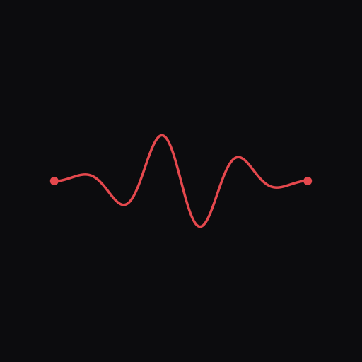

# Essentia CHOP Suite

<p align="center">
  
</p>

Real-time and offline audio analysis for [TouchDesigner](https://derivative.ca/) powered by [Essentia](https://essentia.upf.edu/). Five C++ CHOP plugins expose spectrum analysis, mel bands, MFCCs, pitch detection, key estimation, onset/BPM tracking, and EBU R128 loudness metering — with both real-time (per-frame) and batch (full-file) analysis modes running natively inside TD.

<div align="center">

### **[Interactive Guide — Parameters, Use Cases & Examples](https://darienbrito.github.io/EssentiaTD/)**

[](https://darienbrito.github.io/EssentiaTD/)

</div>

# Install

Simply copy all `.dll` files from [Releases](https://github.com/DarienBrito/EssentiaTD/releases) to your TouchDesigner plugins folder or into a subfolder — TD scans subdirectories of the Plugins folder. That's it! 
You can do it manually or with this command line instruction:

```bash
cp src/build/Release/*.dll "C:/Users/<you>/Documents/Derivative/Plugins/"
```

Restart TouchDesigner to load the new operators. They appear in the OP Create Dialog under their registered names (e.g., Tab > CHOP > "Essentia Spectrum").

## Operators

Each operator (except Spectrum) has a **Mode** parameter that switches between **Realtime** and **Batch** analysis:

| Operator | Realtime Input | Batch Input | Description |
|---|---|---|---|
| **Essentia Spectrum** | Audio CHOP | — | FFT magnitude spectrum as a static sample buffer (fftSize/2+1 bins) |
| **Essentia Spectral** | Spectrum CHOP | Audio CHOP | MFCC, centroid, flux, rolloff, contrast, HFC, complexity, mel bands |
| **Essentia Tonal** | Spectrum CHOP | Audio CHOP | Pitch (YinFFT), HPCP chroma, key/scale, dissonance, inharmonicity |
| **Essentia Rhythm** | Spectrum CHOP | Audio CHOP | Onset detection, BPM estimation, beat phase/confidence |
| **Essentia Loudness** | Audio CHOP | Audio CHOP | EBU R128 loudness, RMS energy, zero-crossing rate |

### Realtime vs Batch Mode

- **Realtime** (default): Per-frame analysis at TD's cook rate. Spectral, Tonal, and Rhythm read from Essentia Spectrum; Loudness reads raw audio. Output is 1 sample per channel.
- **Batch**: Full-file offline analysis on a background thread. All CHOPs take raw audio directly (no Spectrum CHOP needed — each handles its own FFT). Output is N samples (one per analysis frame). Triggered by a Compute pulse or Autocompute toggle.

## Signal Flow

```
Realtime mode:
  Audio CHOP
    ├── Essentia Spectrum ──┬── Essentia Spectral (Mode=Realtime)
    │                       ├── Essentia Tonal    (Mode=Realtime)
    │                       └── Essentia Rhythm   (Mode=Realtime)
    └── Essentia Loudness (Mode=Realtime)

Batch mode:
  File In CHOP ──┬── Essentia Spectral (Mode=Batch)
                 ├── Essentia Tonal    (Mode=Batch)
                 ├── Essentia Rhythm   (Mode=Batch)
                 └── Essentia Loudness (Mode=Batch)
```

**Realtime**: Spectrum is the shared upstream node for the three spectral-domain CHOPs. Loudness takes raw audio directly.
**Batch**: Each CHOP is self-contained — handles its own windowing and FFT internally.

## Recommended Settings

Default parameter values match Essentia's [Music Extractor](https://essentia.upf.edu/streaming_extractor_music.html) recommendations — the canonical reference for music analysis. All defaults work well out of the box.

### Quick Reference (Essentia Music Extractor Defaults)

| Setting | Spectral / Tonal (Batch) | Rhythm (Batch) | Spectrum (Realtime) |
|---|---|---|---|
| FFT Size | 2048 | 2048 | 1024 |
| Hop Size | 1024 | 256 | 512 |
| Window | Blackman-Harris 62 | Blackman-Harris 62 | Blackman-Harris 62 |

### Per-Feature Defaults

| Feature | Parameter | Default | Essentia Recommendation |
|---|---|---|---|
| MFCC | Coefficients / Bands / Freq Range | 13 / 40 / 0–11000 Hz | Standard for music and speech |
| Mel Bands | Count / Type / Freq Range | 40 / power / 0–22050 Hz | 40 bands matches Music Extractor; power type is standard (matches librosa) |
| Centroid | Range | sampleRate / 2 | Normalizes output to frequency range |
| Flux | Norm / Half Rectify | L2 / Off | L2 is more commonly used (Tzanetakis & Cook) |
| Rolloff | Cutoff | 0.85 | 85% energy threshold — standard for brightness estimation |
| Spectral Contrast | Bands | 6 | Octave-based sub-bands |
| HFC | Type | Masri | Default; Jensen/Brossier for stronger high-frequency emphasis |
| Spectral Complexity | Threshold | 0.005 | Captures significant peaks, filters noise |

### Tuning for Specific Use Cases

- **Deep learning / ML features**: Set Mel Bands to 128, enable Log Mel (dB Scale), FFT 2048 / Hop 1024
- **Voice-only analysis**: Narrow MFCC freq to 80–3400 Hz
- **Tonal analysis (pitch, key)**: Use FFT 4096 for better frequency resolution
- **Percussive / onset-heavy material**: Use HFC Type = Jensen or Brossier for stronger transient emphasis; enable Flux Half Rectify
- **Electronic / dance music**: Use Key Profile = EDMA in Tonal CHOP

## Spectrum: Analysis, Not Visualization

Essentia Spectrum outputs a linear-bin FFT magnitude spectrum designed for feeding downstream analysis algorithms (Spectral, Tonal, Rhythm). Its bins are uniformly spaced in Hz, which is what Essentia's algorithms expect but looks bottom-heavy when plotted directly — most musical detail is crammed into the lower bins.

For spectral visualization, use TouchDesigner's built-in **Audio Spectrum CHOP**, which provides a perceptually scaled output suited for display. Note that TD's Audio Spectrum cannot be used as input to the Essentia analysis CHOPs — they require the linear-bin format that Essentia Spectrum provides.

## Mono by Design

The suite processes a single audio channel. This is intentional — stereo analysis would double every output channel (e.g., `mfcc0_L`, `mfcc0_R`, `spectral_centroid_L`, `spectral_centroid_R`), making the output unwieldy and harder to map in a visual context.

If you need stereo-aware analysis, select each channel independently using a **Select CHOP** and run two separate analysis chains. This keeps the output organized and lets you choose which features to extract per channel.

**Recommended approach for stereo sources** — In most audio-reactive scenarios, collapsing to mono before analysis preserves all relevant information. Sum left and right with a **Math CHOP** (Combine Channels = Average) before feeding into Essentia Spectrum. This captures the full frequency content of both channels without phase cancellation artifacts that a simple channel pick might miss.

## Output Reference & Use Cases

### Essentia Spectrum

| Channel | Range | What it measures | Suggested use in TouchDesigner |
|---|---|---|---|
| `spectrum` | 0 – fftSize/2+1 samples | FFT magnitude per bin | Audio-reactive bar graphs, 3D terrain from frequency data, custom spectral visualizers, input for external analysis |

### Essentia Spectral

| Channel | Range | What it measures | Suggested use in TouchDesigner |
|---|---|---|---|
| `mfcc0`–`mfcc12` | unbounded (typically -50 to 50) | Timbral fingerprint coefficients | Timbre classification — cluster similar sounds, drive visual style transitions based on tonal character, distinguish instruments |
| `spectral_centroid` | 0 – sampleRate/2 Hz | Center of mass of the spectrum (brightness) | Map to color temperature (warm/cool), particle speed, lighting intensity — high centroid = bright, shimmery sounds |
| `spectral_flux` | 0+ | Frame-to-frame spectral change | Detect timbral transitions, trigger visual events on sudden textural shifts, novelty detection |
| `spectral_rolloff` | 0 – sampleRate/2 Hz | Frequency below which 85% of energy lies | Distinguish bright vs warm sounds, control high-pass/low-pass visual filtering, EQ-style visuals |
| `spectral_contrast0`–`5` | unbounded | Peak-to-valley ratio in 6 sub-bands | Multi-band visual layering, texture detection (tonal vs noisy content), per-band glow/intensity |
| `hfc` | 0+ | High-frequency content energy | Hi-hat/cymbal reactivity, percussive high-end triggers, sparkle/shimmer effects |
| `spectral_complexity` | 0+ | Number of significant spectral peaks | Visual density — simple tones = sparse, complex sounds = dense particle fields or geometry |
| `mel0`–`melN` | 0+ | Energy in perceptual frequency bands | Multi-band audio visualizers, frequency-mapped color gradients, per-band particle systems, ML input features |

### Essentia Tonal

| Channel | Range | What it measures | Suggested use in TouchDesigner |
|---|---|---|---|
| `pitch` | 0+ Hz | Fundamental frequency (YinFFT) | Pitch-to-note mapping for generative music visuals, vocal tracking, pitch-controlled animation speed or position |
| `pitch_confidence` | 0 – 1 | Reliability of pitch estimate | Gate pitch-driven effects — only apply when confidence is high, crossfade between pitched/unpitched visual modes |
| `note_a`–`note_gs` | 0 – 1 | Chroma energy per pitch class (A through G#, bin 0 = reference freq) | Harmony wheels, chord visualization, map each note to a color, detect chord changes for scene transitions |
| `key` | 0 – 11 (encoded) | Detected musical key | Key-adaptive color palettes, scene theming per key, generative pattern selection |
| `key_scale` | 0 = major, 1 = minor | Major or minor tonality | Mood-driven visuals — major = warm/bright palette, minor = cool/dark palette |
| `key_strength` | 0 – 1 | Confidence of key estimate | Gate key-driven effects, blend strength into color saturation |
| `dissonance` | 0 – 1 | Sensory roughness | Glitch/distortion intensity, visual chaos/turbulence, tension indicators |
| `inharmonicity` | 0 – 1 | Deviation from harmonic series | Distinguish percussion from melody, drive material textures (metallic vs organic) |

### Essentia Rhythm

| Channel | Range | What it measures | Suggested use in TouchDesigner |
|---|---|---|---|
| `onset` | 0 or 1 | Transient attack detected this frame | Flash/strobe triggers, particle bursts, camera cuts, step-sequenced events |
| `onset_strength` | 0+ | Continuous onset detection function | Velocity-sensitive triggers — scale burst intensity by strength, smooth onset envelope |
| `bpm` | BPM min – max | Estimated tempo | Sync animation speeds, LFO rates, generative pattern timing to the music's tempo |
| `beat` | 0 or 1 | Beat trigger on the estimated grid | Rhythmic pulsing, beat-locked transitions, synchronized step-sequencing |
| `beat_phase` | 0 – 1 (sawtooth) | Position within current beat | Smooth beat-synced animation — feed into easing curves, continuous rhythmic motion, pendulum effects |
| `beat_confidence` | 0 – 1 | Reliability of beat tracking | Fade in beat-synced effects only when tracking is stable, crossfade to onset-only mode when low |

### Essentia Loudness

| Channel | Range | What it measures | Suggested use in TouchDesigner |
|---|---|---|---|
| `loudness` | dB (typically -100 to 0) | Instantaneous perceived loudness | Fast VU-meter response, frame-level reactive scaling of geometry or opacity |
| `loudness_momentary` | dB | EBU R128 momentary (400 ms window) | Smooth level metering, dynamic scaling of visual elements, responsive but stable |
| `loudness_shortterm` | dB | EBU R128 short-term (3 s window) | Scene-level intensity, ambient lighting adjustments, macro-level energy |
| `loudness_integrated` | dB | Running gated average (EBU R128) | Overall show level monitoring, normalization reference, long-term gain tracking |
| `dynamic_range` | dB (0+) | Peak-to-valley swing of short-term loudness | Detect builds and drops, drive contrast-based transitions, tension/release mapping |
| `rms` | 0 – 1 | Root mean square energy | Simple amplitude-reactive scaling — size, opacity, displacement. The classic "audio reactive" signal |
| `zcr` | 0 – 1 | Zero crossing rate (noisiness) | Distinguish noise from pitched content — high ZCR = noisy/percussive, low ZCR = tonal. Drive grain/static effects |


# Build from source

## Prerequisites

### 1. Essentia Static Library

Build `essentia.lib` (MSVC x64 static) and place headers + lib under:

```
src/vendor/essentia/
  ├── include/essentia/   # Essentia headers
  └── lib/essentia.lib    # Static library
```

### 2. TouchDesigner SDK Headers

Copy from your TouchDesigner installation:

```
C:/Program Files/Derivative/TouchDesigner/Samples/CPlusPlus/
  CHOP_CPlusPlusBase.h
  CPlusPlus_Common.h
```

Into `src/` alongside the plugin source files.

## Build

```bash
cd src
cmake -B build -G "Visual Studio 17 2022" -A x64
cmake --build build --config Release
```

Produces 5 DLLs in `src/build/Release/`.

## Architecture Notes

- Each unified CHOP (Spectral, Tonal, Rhythm, Loudness) supports both Realtime and Batch modes via a **Mode** parameter
- **Realtime mode**: per-frame analysis, `timeslice = false` (except Loudness which uses `timeslice = true`), output `sampleRate` = component FPS
- **Batch mode**: full-file analysis on a background thread, results cached until next computation, output `sampleRate` = audioRate / hopSize
- Batch computation is triggered by a Compute pulse or Autocompute toggle (detects input changes via audio fingerprinting)
- Internally, all four unified CHOPs inherit from `UnifiedCHOPBase<Derived>` (CRTP) which handles mode branching, async polling, and error/warning plumbing
- Spectrum outputs use `startIndex = 0` to produce a static indexed buffer
- All downstream CHOPs use `inputMatchIndex = -1` to avoid inheriting the audio sample rate from upstream
- Every Essentia `compute()` call is wrapped in try/catch to prevent crashes in TD
- All Essentia algorithm outputs must be bound before calling `compute()`, even if the output value is unused

## License

AGPL-3.0-or-later

---

<p align="center">
A project by <strong>Darien Brito</strong><br><br>
<a href="https://www.patreon.com/darienbrito">Patreon</a> · <a href="https://www.instagram.com/darien.brito/">Instagram</a><br><br>
<sub>Essentia CHOP Suite</sub>
</p>
