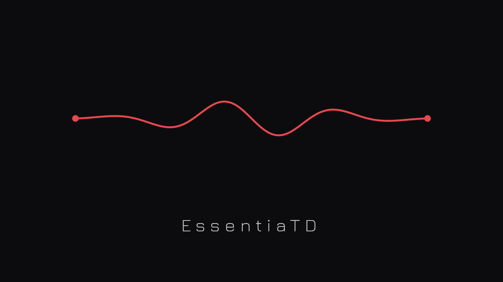
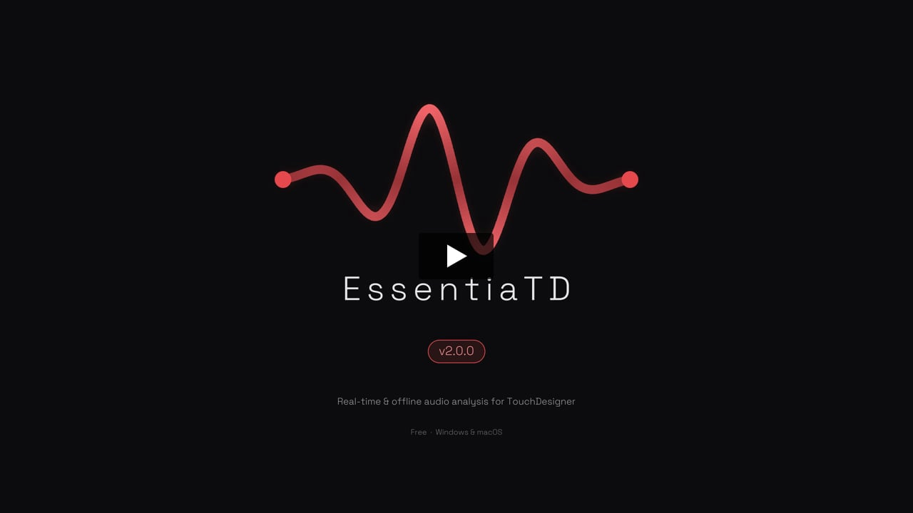

# Essentia CHOP Suite
## Windows (x64) & macOS (Apple Silicon)

Real-time and offline audio analysis for [TouchDesigner](https://derivative.ca/) powered by [Essentia](https://essentia.upf.edu/). Five C++ CHOP plugins expose spectrum analysis, mel bands, MFCCs, pitch detection, key estimation, onset/BPM tracking, and EBU R128 loudness metering, with both real-time (per-frame) and batch (full-file) analysis modes running natively inside TD.

**v2.0: connect audio, get analysis.** Every analyzer takes raw audio directly in both modes and runs its own FFT internally. No intermediate Spectrum CHOP, no per-network FFT bookkeeping. This is a breaking change from v1.x; see [Migrating from v1.x](#migrating-from-v1x).

<div align="center">

### **[Interactive Guide — Parameters, Use Cases & Examples](https://darienbrito.github.io/EssentiaTD/)**

[](https://darienbrito.github.io/EssentiaTD/)

</div>

# Overview

[](https://vimeo.com/1211981928)

*Click to watch on Vimeo.*

# Install

There are three ways to install the library. The installer (a) is the simplest. Use the zip (b) if you prefer to copy files yourself, or build from source (c) if you are a developer.

### a) Installer (recommended)

[](https://github.com/DarienBrito/EssentiaTD/releases/latest/download/EssentiaTD-Setup.exe)
[](https://github.com/DarienBrito/EssentiaTD/releases/latest/download/EssentiaTD.pkg)

These links always point to the latest release. Older versions are on the [Releases](https://github.com/DarienBrito/EssentiaTD/releases) page.

**Windows**: run `EssentiaTD-Setup.exe`. It installs the plugins into `Documents\Derivative\Plugins\Essentia` for the current user (no admin rights needed). Close TouchDesigner before installing; the installer checks and will remind you.

**macOS**: open `EssentiaTD.pkg`. It installs the plugins into `~/Library/Application Support/Derivative/TouchDesigner099/Plugins/Essentia` (no admin password needed). Plugins installed from the pkg do not carry the quarantine flag, so they load in TouchDesigner without the per-bundle Gatekeeper prompts that the zip route requires.

Restart TouchDesigner afterwards to load the new operators.

> **Unsigned installer warnings**
>
> **Windows:** SmartScreen may warn about an unrecognized publisher. Click **More info**, then **Run anyway**.
>
> **macOS:** Gatekeeper blocks the unsigned package on first open. If it does not offer an Open option, go to **System Settings > Privacy & Security**, scroll down to the blocked package notice, and click **Open Anyway**. On older macOS versions you can also Control-click the .pkg and choose **Open**.

### b) From Releases (zip, manual copy)

Download the latest zip for your platform from [Releases](https://github.com/DarienBrito/EssentiaTD/releases), extract it, and copy the plugins to your TouchDesigner plugins folder (TD scans subdirectories too):

**Windows**: copy the 5 `.dll` files into `C:\Users\<you>\Documents\Derivative\Plugins\Essentia\`.

**macOS**: copy the 5 `.plugin` bundles into `~/Library/Application Support/Derivative/TouchDesigner099/Plugins/Essentia/`.

Restart TouchDesigner to load the new operators. They appear in the OP Create Dialog under their registered names (e.g., Tab > CHOP > "Essentia Spectrum").

> **First-run security warnings**
>
> **Windows:** The first time you load the plugins, Windows may show a security dialog warning about an unrecognized publisher. This is normal for unsigned DLLs — click **Run Anyway** to proceed.
>
> **macOS:** Gatekeeper will flag the plugins as unverified. Open **System Settings > Privacy & Security**, find the blocked plugin, and click **Open Anyway**. You may need to do this once per `.plugin` bundle.
>
> After the first successful load, these warnings will not appear again.

### c) From source

After [building from source](#build-from-source), the plugins are in `src/build/Release/`:

**Windows:**
```bash
mkdir -p "C:/Users/<you>/Documents/Derivative/Plugins/Essentia"
cp src/build/Release/*.dll "C:/Users/<you>/Documents/Derivative/Plugins/Essentia/"
```

**macOS:**
```bash
mkdir -p ~/Library/Application\ Support/Derivative/TouchDesigner099/Plugins/Essentia
cp -R src/build/Release/*.plugin ~/Library/Application\ Support/Derivative/TouchDesigner099/Plugins/Essentia/
```

## Operators

Every operator takes raw audio. The four analyzers have a **Mode** parameter switching between **Realtime** (per-frame) and **Batch** (full-file) analysis; each runs its own FFT internally in both modes.

| Operator | Input | Description |
|---|---|---|
| **Essentia Spectral** | Audio CHOP | MFCC, centroid, flux, rolloff, contrast, HFC, complexity, mel bands, PCA |
| **Essentia Tonal** | Audio CHOP | Pitch (YinFFT), HPCP chroma, key/scale, dissonance, inharmonicity |
| **Essentia Rhythm** | Audio CHOP | Onset detection, BPM estimation, beat phase/confidence |
| **Essentia Loudness** | Audio CHOP | EBU R128 loudness, RMS energy, zero-crossing rate |
| **Essentia Spectrum** | Audio CHOP | FFT magnitude + phase as a static sample buffer (fftSize/2+1 bins), for visualization, GLSL, resynthesis, or custom processing. The analyzers do not use it. |

**Bin count is `(fftSize + zeroPad) / 2 + 1`, not a power of two.** A real-valued signal has a conjugate-symmetric spectrum, so only the non-negative frequencies carry unique information: bin 0 is DC, the top bin is Nyquist (`sampleRate / 2`), and the power of two is the number of *intervals* between them rather than the number of bins. The 1024 default therefore gives 513 bins, spaced `sampleRate / (fftSize + zeroPad)` apart (46.875 Hz at 48 kHz). Zero padding changes the count (half pad = 769, full pad = 1025), so read it off the CHOP instead of hardcoding it.

### Realtime vs Batch Mode

- **Realtime** (default): per-frame analysis at TD's cook rate. Incoming audio accumulates in an internal ring buffer; each cook analyzes the latest full analysis window. Output is 1 sample per channel.
- **Batch**: full-file offline analysis on a background thread. Output is N samples (one per analysis frame). Triggered by a Compute pulse or Autocompute toggle.

Flipping Mode never requires rewiring: both modes read the same audio input.

### FFT settings live on each operator

Each analyzer's **Analysis** page carries its FFT parameters. **FFT Size** and **Window Type** apply in both modes; **Hop Size** and **Zero Padding** are batch-only (realtime analyzes the latest window once per cook, and zero padding narrows bin spacing without adding true resolution).

- **Spectral** defaults to 2048.
- **Tonal** defaults to **auto**: the smallest FFT whose bin spacing separates adjacent semitones at the incoming sample rate (4096 at 44.1/48 kHz, 8192 at 88.2/96 kHz). Picking a smaller size explicitly raises a warning in both modes.
- **Rhythm** batch uses FFT 2048 / hop 512; realtime has its own **Window Size** menu (512-4096, default 1024, see below).

### Tonal and FFT resolution

Key and HPCP need bin spacing of at most 15.56 Hz (a semitone at middle C), which is why Tonal's auto default resolves to 4096 or 8192 depending on sample rate. Two things are worth knowing about the too-coarse warning:

**It means "may be unreliable", not "is wrong".** Measured across three tracks, the smallest adequate FFT size was content-dependent: 1024, 2048 and 4096 respectively. 4096 is simply the smallest size at which all three were correct.

**Do not judge tonal output by how confident it looks.** The wrong answer is not noisy or obviously broken; it presents as a stable, settled key. On one test track a 1024-point analysis produced the *wrong* key at strength 0.608 while the *correct* answer at 4096 reported only 0.531. `key_strength` cannot be used to detect this failure.

Full method and measurements: [docs/tonal-fft-resolution.md](docs/tonal-fft-resolution.md).

## Signal Flow

```
Realtime or Batch — audio to every operator:

  Audio / File In CHOP ──┬── Essentia Spectral   (own FFT, default 2048)
                         ├── Essentia Tonal      (own FFT, default auto)
                         ├── Essentia Rhythm     (own FFT, realtime window 1024)
                         ├── Essentia Loudness   (raw audio)
                         └── Essentia Spectrum   (magnitude + phase output)
```

Every operator is self-contained. There is no shared upstream FFT node and no ordering constraint between analyzers.

**Why per-operator FFT:** a shared spectrum forces one FFT size onto operators with conflicting needs. Tonal needs 4096 to resolve semitones, but feeding Rhythm a 4096 spectrum instead of 1024 cut onset-detection F1 from 0.47 to 0.13 on a measured 263-onset reference, because the longer window blunts the transients onset detection depends on. v2.0 removes the conflict: each operator gets the window its algorithm wants. The converted Rhythm at window 1024 reproduces the previous implementation's onset F1 exactly (delta 0.000 on the same track and ground truth).

## Migrating from v1.x

v2.0 is a breaking change: in v1.x, Spectral, Tonal, and Rhythm consumed an Essentia Spectrum CHOP in realtime mode. In v2.0 they consume audio directly.

- **A Spectrum CHOP wired into an analyzer raises an error** ("As of v2.0 this operator analyzes raw audio and computes its own FFT — connect the audio directly"). Fix: delete the Spectrum node from the chain and wire the audio straight in. The error fires in both modes, so broken networks are diagnosed in one glance instead of producing garbage.
- **FFT settings moved onto each analyzer** (page "Analysis"). If your v1.x network tuned an upstream Spectrum's FFT Size for Tonal, set Tonal's own FFT Size instead, or leave it on auto.
- **Networks that already wired raw audio into analyzers** (a natural first attempt that produced nothing useful in v1.x) now simply work.
- **Essentia Spectrum stays available** as an output operator (magnitude + phase) for visualization or custom processing. Nothing downstream in this suite needs it.
- **Loudness is unchanged**: it always took raw audio.
- **Batch BPM values on non-44.1 kHz files change, correctly** (see below).

## Rhythm: analysis window vs cook rate

Realtime analysis reads the **latest window of audio once per cook**. Two consequences worth knowing:

**If the per-cook audio chunk is larger than the analysis window, the excess is never analyzed.** At 30 fps and 48 kHz each cook delivers 1600 samples; a 1024 window skips 576 of them (36% of the audio), and onset detection degrades sharply — measured onset F1 collapsed from 0.461 to below 0.16 across all windows at 30 fps. The operator warns whenever `window < sampleRate / fps` and tells you which way to fix it (raise the window, or raise TD's fps). Note this also fires for a 512 window at 60 fps (800-sample cooks): 512 is only fully sound above ~94 fps.

**Longer windows are not safer.** Onset timing smears with window length; at 4096 the onsets that fire are mostly mistimed beyond a 50 ms tolerance (precision 0.056). Keep the default 1024 unless you have a specific reason.

## Rhythm: batch BPM and sample rate

Batch BPM uses Essentia's RhythmExtractor2013, which requires 44.1 kHz input. Non-44.1 kHz audio is resampled internally (libsamplerate) before BPM extraction; onset detection is frame-based and rate-aware, so it never needed resampling. Verified: the same 48 kHz file analyzed natively at 44.1 kHz and through the resampler agree to two decimals.

> **If you have batch BPM numbers from v1.1.8:** that release shipped without the internal resampler, so batch BPM on non-44.1 kHz files was computed at the native rate and came out scaled by roughly `rate/44100` (about 9% high on 48 kHz files), with an easy-to-miss "Resample to 44100 Hz failed" warning. Expect v2.0 to report different (correct) values on the same files.

## Spectrum: raw data, not a display

Essentia Spectrum outputs a linear-bin FFT magnitude spectrum plus phase. Linear bins are what analysis and DSP code expect, but they look bottom-heavy when plotted directly; most musical detail is crammed into the lower bins. Use it for GLSL, resynthesis, or custom feature work. For a perceptually scaled on-screen spectrum, TouchDesigner's built-in **Audio Spectrum CHOP** is the better display choice.

## Mono by Design

The suite processes a single audio channel. This is intentional — stereo analysis would double every output channel (e.g., `mfcc0_L`, `mfcc0_R`, `spectral_centroid_L`, `spectral_centroid_R`), making the output unwieldy and harder to map in a visual context.

If you need stereo-aware analysis, select each channel independently using a **Select CHOP** and run two separate analysis chains. This keeps the output organized and lets you choose which features to extract per channel.

**Recommended approach for stereo sources** — In most audio-reactive scenarios, collapsing to mono before analysis preserves all relevant information. Sum left and right with a **Math CHOP** (Combine Channels = Average) before feeding the analyzers. This captures the full frequency content of both channels without phase cancellation artifacts that a simple channel pick might miss.

**Channel choice measurably shifts results.** Batch mode analyzes channel 0 (left) only when fed a stereo CHOP — it warns, but the numbers still differ from a mono average. Measured on the same file with identical settings, Tonal's batch `key_strength` reads 0.825 from the L+R average and 0.882 from the left channel alone (same detected key). When comparing analysis values across sessions or against published numbers, always state how the audio was collapsed to mono.


# Build from source

## Prerequisites

### 1. Essentia Static Library

Build the Essentia static library and place headers + lib under:

```
src/vendor/essentia/
  ├── include/essentia/     # Essentia headers
  └── lib/
      ├── essentia.lib      # Windows (MSVC x64 static)
      ├── samplerate.lib    # Windows — libsamplerate (Resample dependency)
      ├── libessentia.a     # macOS (universal)
      └── libsamplerate.a   # macOS
```

The `ci/essentia-CMakeLists.txt` build produces both archives (libsamplerate 0.2.2 is fetched pinned at configure time). See [docs/building-essentia.md](docs/building-essentia.md) for build instructions on both platforms.

### 2. TouchDesigner SDK Headers

Copy from your TouchDesigner installation:

**Windows:**
```
C:/Program Files/Derivative/TouchDesigner/Samples/CPlusPlus/
  CHOP_CPlusPlusBase.h
  CPlusPlus_Common.h
```

**macOS:**
```
/Applications/TouchDesigner.app/Contents/Resources/Samples/CPlusPlus/
  CHOP_CPlusPlusBase.h
  CPlusPlus_Common.h
```

Into `src/` alongside the plugin source files.

## Build

### Windows
```bash
cd src
cmake -B build -G "Visual Studio 17 2022" -A x64
cmake --build build --config Release
```

### macOS
```bash
cd src
cmake -B build
cmake --build build --config Release
```

Produces 5 plugins in `src/build/Release/` (`.dll` on Windows, `.plugin` bundles on macOS).

## Architecture Notes

- Each unified CHOP (Spectral, Tonal, Rhythm, Loudness) supports both Realtime and Batch modes via a **Mode** parameter
- **Realtime mode**: per-frame analysis, `timeslice = false`, output `sampleRate` = component FPS. Audio accumulates in a ring buffer (`Shared/RTFrameProcessor.h`); each cook runs Windowing, FFT, and CartesianToPolar over the latest full window
- **Batch mode**: full-file analysis on a background thread, results cached until next computation, output `sampleRate` = audioRate / hopSize
- Batch computation is triggered by a Compute pulse or Autocompute toggle (detects input changes via audio fingerprinting)
- Internally, all four unified CHOPs inherit from `UnifiedCHOPBase<Derived>` (CRTP) which handles mode branching, async polling, and error/warning plumbing
- All outputs use `startIndex = 0`, so sample indices always run 0..N-1 instead of tracking the timeline. Without it a 1-sample realtime output sits at an ever-advancing index, and merging it with a normal TD CHOP forces a span of hundreds of thousands of samples
- All downstream CHOPs use `inputMatchIndex = -1` to avoid inheriting the audio sample rate from upstream
- Every Essentia `compute()` call is wrapped in try/catch to prevent crashes in TD
- All Essentia algorithm outputs must be bound before calling `compute()`, even if the output value is unused
- The Essentia lib is linked whole-archive (factory registrars must survive static linking); `samplerate` is linked plainly. An algorithm is only usable if its source is compiled **and** it has a `Registrar<>` entry in `ci/essentia_algorithms_reg.cpp` — a missing registrar makes `create()` throw at runtime

## License

AGPL-3.0-or-later

---

<p align="center">
A project by <strong>Darien Brito</strong><br><br><a href="https://www.darienbrito.com">Website</a> · 
<a href="https://www.patreon.com/darienbrito">Patreon</a> · <a href="https://www.instagram.com/darien.brito/">Instagram</a><br><br>
<sub>Essentia CHOP Suite</sub>
</p>
